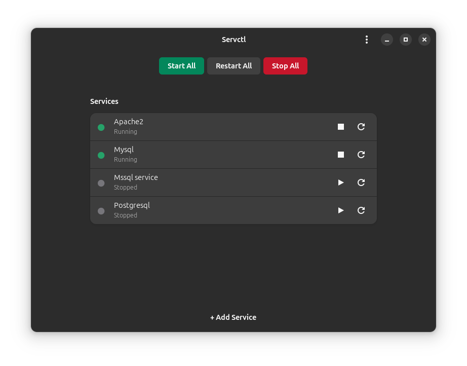
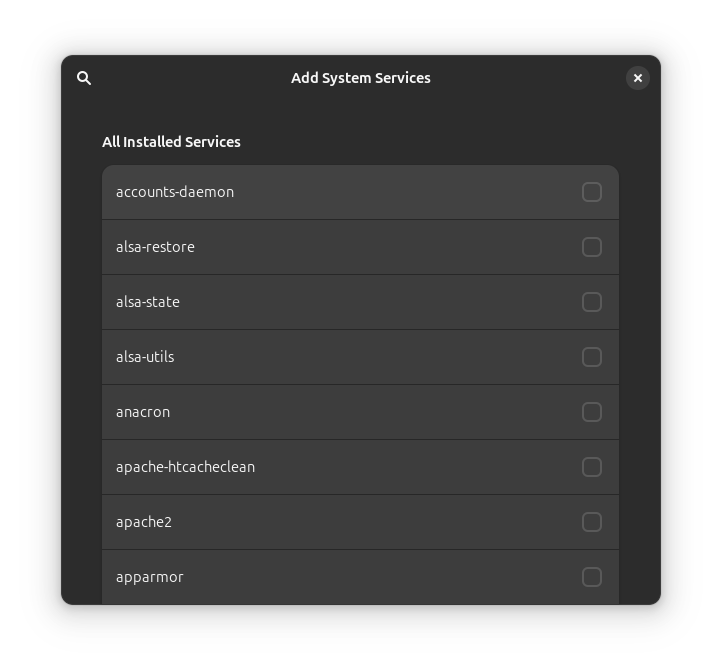

# Servctl

Servctl is a simple, lightweight systemd service manager for the GNOME desktop, built with **GTK 4** and **Libadwaita**. It provides an intuitive graphical interface to monitor, start, stop, and restart system services without touching the terminal.

## Features

- **Service Dashboard**: Pin your most used services to the main window for quick access.
- **Real-time Status Indicators**: 
  - <span foreground='#26a269'>●</span> **Green**: Service is active/running.
  - <span foreground='#77767b'>●</span> **Gray**: Service is inactive/stopped.
- **Service Management**: Start, stop, and restart services with a single click.
- **Service Discovery**: A dedicated "Add Service" dialog to browse all system units, with smart filtering for aliases and template units.
- **Batch Actions**: Quickly **Start All**, **Stop All**, or **Restart All** services currently pinned to your dashboard.
- **Asynchronous Design**: All systemd interactions are non-blocking, keeping the UI smooth and responsive even during authentication prompts.
- **Persistent Configuration**: Your pinned services are saved across sessions using GSettings.

## Screenshots





## Dependencies

To build Servctl, you will need the following libraries:

- `gtk4` (>= 4.10)
- `libadwaita-1` (>= 1.3)
- `glib-2.0`
- `gio-2.0`
- `systemd` (specifically `systemctl` in your PATH)

## Development & Building

Servctl uses the **Meson** build system. For convenience, a `build.sh` script is provided to automate the setup, compilation, and execution of the application with the correct GSettings environment.

### Quick Start (Recommended for Development)

Run the following command to clean, build, and launch Servctl immediately:

```bash
chmod +x build.sh  # Ensure script is executable
./build.sh
```

### Manual Build

If you prefer to run the steps manually:

1. **Setup the build directory**:
   ```bash
   meson setup build
   ```

2. **Compile**:
   ```bash
   meson compile -C build
   ```

3. **Compile GSettings schema** (required for the app to find its settings):
   ```bash
   glib-compile-schemas data
   export GSETTINGS_SCHEMA_DIR=data
   ```

4. **Run**:
   ```bash
   ./build/servctl
   ```

## Installation

To install the application and its system-wide GSettings schema:

```bash
sudo meson install -C build
```

## Contributing

Contributions are welcome! If you find a bug or have a feature request, please open an issue or submit a pull request.

## License

This project is licensed under the MIT License - see the [LICENSE](LICENSE) file for details.
